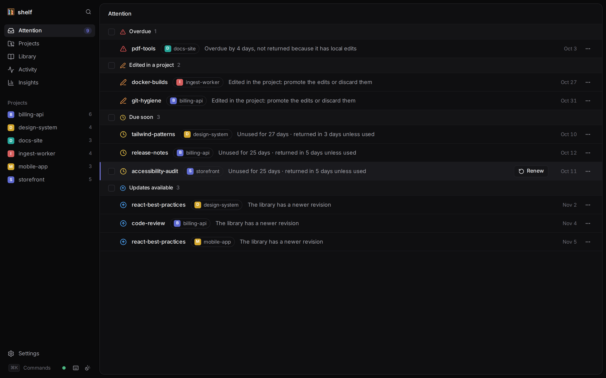
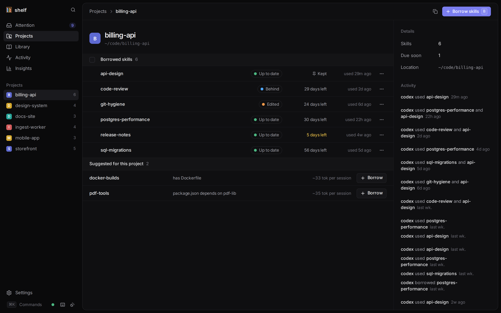
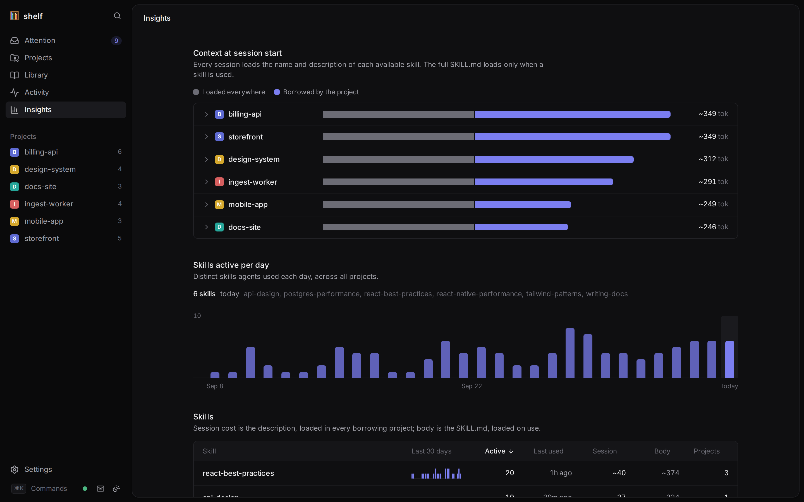
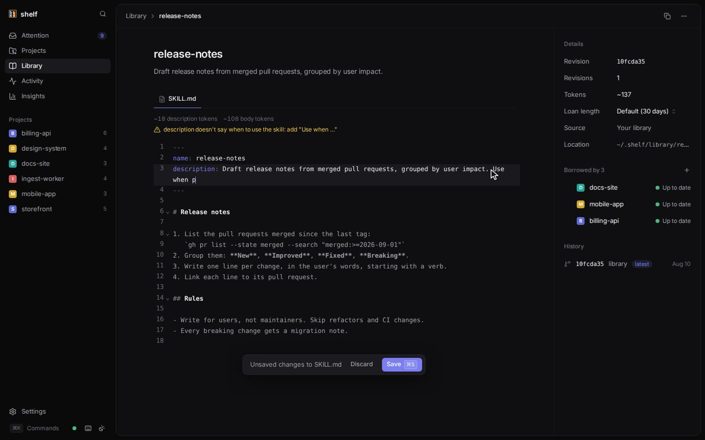
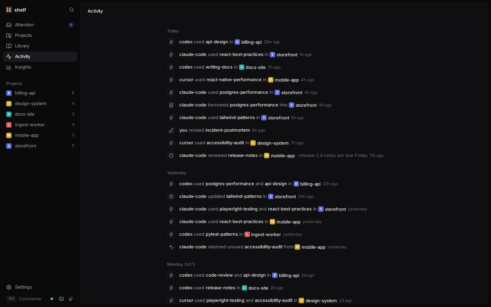

<p align="center">
  
</p>

<h1 align="center">shelf</h1>

<p align="center">
  A personal skill library for coding agents.<br>
  <a href="https://limyuquan.github.io/shelf/"><b>Website</b></a> ·
  <a href="https://limyuquan.github.io/shelf/docs/"><b>Docs</b></a> ·
  <a href="https://limyuquan.github.io/shelf/demo/">Live demo</a> ·
  <a href="#install">Install</a> ·
  <a href="https://limyuquan.github.io/shelf/llms.txt">llms.txt</a>
</p>

<picture>
  <source media="(prefers-color-scheme: light)" srcset="assets/media/dashboard-light.png">
  
</picture>

Keep your [Agent Skills](https://agentskills.io) in one library, **borrow** them
into the projects that need them, and let loans **expire** so stale skills don't
pile up. Using a skill renews its loan; skills nobody uses go back on the shelf.
It works with Claude Code, Codex, Cursor, Gemini CLI, Copilot, OpenCode and any
other agent that reads `SKILL.md` folders.

```console
$ shelf borrow api-design commit-messages
Borrowed api-design (due 2026-11-06) → .agents/skills, .claude/skills
Borrowed commit-messages (due 2026-11-06) → .agents/skills, .claude/skills

$ shelf status
storefront  ~/code/storefront

SKILL                 CONTENT  DUE                   USED     POLICY  REVISION
api-design            current  2026-11-06  30d left  today    pinned  528c1a7b60
commit-messages       current  2026-11-06  30d left  never    pinned  b1c1c83212
git-hygiene           current  2026-10-13  6d left   never    pinned  098f8b659c
react-best-practices  current  2026-11-06  30d left  today    pinned  2bf910a993

Next steps:
  shelf renew git-hygiene --reason "<why>"
      git-hygiene has gone unused and is due in 6 day(s). Renew it if the project still needs it, otherwise `shelf return git-hygiene`
```

- **One library, the source of truth.** No more copies of the same skill
  drifting apart across repos. Edits flow back with `shelf promote` and out with
  `shelf update`, and every change is a revision you can compare and restore.
- **Skills come and go on their own.** Hooks in Claude Code and Codex renew a
  loan each time an agent uses the skill; loans that go unused are returned. Keep
  the few a project always needs with `shelf keep`.
- **Less context.** A project carries only the skills it uses, instead of every
  global skill loading into every session. `shelf insights` shows what each
  project loads.
- **Built for agents.** Every command takes `--json` and never prompts, and
  agents get a one-line note at session start only when something needs them.
- **Your library is the trust boundary.** Skills from elsewhere are audited
  locally before they come in, and agents can't import remote skills unless you
  allow it.
- **Local-first.** One binary, no account, no Node. The dashboard runs on
  127.0.0.1 and works offline.

## Why I built this

<!-- DRAFT: user to review (kept in sync with the website) -->

I use coding agents every day, and I write my own skills for them. The same
skills, my Convex skills for one, got copied into several projects, and the
copies drifted apart until no one knew which was current. Global skill folders
didn't help: each harness has its own, and everything in them loads into every
session whether it's relevant or not, which costs context. Public skill
registries are a supply-chain risk, and they treat your own skills as
second-class.

I wanted skills to come into a project when it needs them and leave on their own
once they're no longer used, with my own library as the source of truth and the
trust boundary. That's shelf. I use it every day on my own projects.

— [@limyuquan](https://github.com/limyuquan)

## Install

```sh
npm install -g @limyuquan/shelf   # installs only your platform's binary; no install scripts
shelf setup                       # creates ~/.shelf, installs the shelf skill and the hooks
```

Or download a binary for macOS, Linux or Windows from the
[releases page](https://github.com/limyuquan/shelf/releases) and verify it with
`SHA256SUMS`. See [Installation](https://limyuquan.github.io/shelf/docs/installation/)
for upgrading, uninstalling and building from source.

## Quick start

```sh
shelf new pdf-tools -d "Fill and merge PDFs. Use when a task involves PDF files."
cd ~/code/storefront
shelf borrow pdf-tools     # copied into .agents/skills and .claude/skills, due in 30 days
shelf status               # loans, their states and what to do next
shelf ui                   # the dashboard
```

Already have skills copied into projects by hand? `shelf scan ~/code` finds every
copy, and `shelf adopt` brings them into the library without overwriting
anything. See the [Quickstart](https://limyuquan.github.io/shelf/docs/quickstart/)
and [Migrating existing skills](https://limyuquan.github.io/shelf/docs/migrating/).

## How it works

| | |
|---|---|
| **Library** | `~/.shelf/library/<skill>/`. Edit skills with any editor; shelf records each change as an immutable, content-addressed revision. |
| **Loan** | A project borrows one revision of a skill until a due date. The skill is copied into `.agents/skills/` (Codex, Cursor, Gemini CLI, Copilot, OpenCode, …) and `.claude/skills/` (Claude Code). |
| **Renew on use** | Each use moves the due date 30 days out (or the skill's own loan length). A loan only comes due after going unused. |
| **Expiry** | Overdue loans are returned at the next session start, `shelf status` or `shelf sync`. Copies with local edits are never deleted. |
| **Keep** | `shelf keep <name>` for skills covering a project's direct dependencies, like Convex skills in a Convex app. Kept loans never expire. |
| **Lockfile** | `.agents/shelf.lock.json` records which skills shelf manages and at which revision. It has no timestamps, so commit it without merge churn. |

Each loan has a content state (`current`, `behind`, `modified`, `diverged` or
`missing`) computed from the revision borrowed, the library's latest and the
files on disk. [Concepts](https://limyuquan.github.io/shelf/docs/concepts/)
defines every term.

## The dashboard

`shelf ui` opens a local dashboard that updates live as your agents work. Try it
with sample data in the [live demo](https://limyuquan.github.io/shelf/demo/).

<table>
  <tr>
    <td width="50%"></td>
    <td width="50%"></td>
  </tr>
  <tr>
    <td><b>Projects.</b> Each loan's state, due date and last use, with suggestions from the project's dependencies.</td>
    <td><b>Insights.</b> What each project loads at session start, and which skills agents actually use.</td>
  </tr>
  <tr>
    <td></td>
    <td></td>
  </tr>
  <tr>
    <td><b>Library.</b> Edit SKILL.md in the browser, compare and restore revisions, push updates to chosen projects.</td>
    <td><b>Activity.</b> Which agent did what, and when.</td>
  </tr>
</table>

It also has an Attention page for every loan that needs you, ⌘K search across
skill content, keyboard navigation, dark and light themes, and a layout for
phones. [Dashboard](https://limyuquan.github.io/shelf/docs/dashboard/) covers
every page.

## For agents

Every command accepts `--json` and prints exactly one line:

```json
{ "schemaVersion": 1, "ok": true, "data": { … } }
{ "schemaVersion": 1, "ok": false, "error": { "code": "SKILL_NOT_FOUND", "message": "…", "hint": "Run `shelf catalog` to list available skills" } }
```

Commands never prompt, are safe to retry, and exit with a distinct code per
error class. `shelf status --json` returns `data.actions`: runnable next steps.
`shelf guide` prints the full guide for agents; the bundled skill that
`shelf setup` installs is about ten lines.

The documentation is written for agents as much as for people:
[llms.txt](https://limyuquan.github.io/shelf/llms.txt) lists every page,
[llms-full.txt](https://limyuquan.github.io/shelf/llms-full.txt) has all of them
in one file, and every page is also Markdown at its URL with `.md`. See
[Working with agents](https://limyuquan.github.io/shelf/docs/agents/).

## Documentation

The full docs are at **[limyuquan.github.io/shelf/docs](https://limyuquan.github.io/shelf/docs/)**,
and in [`docs/`](docs) as Markdown.

| Getting started | Guides | Reference |
|---|---|---|
| [Introduction](https://limyuquan.github.io/shelf/docs/introduction/) | [Borrowing](https://limyuquan.github.io/shelf/docs/borrowing/) | [CLI reference](https://limyuquan.github.io/shelf/docs/cli/) |
| [Installation](https://limyuquan.github.io/shelf/docs/installation/) | [Keeping skills current](https://limyuquan.github.io/shelf/docs/keeping-skills-current/) | [Configuration](https://limyuquan.github.io/shelf/docs/configuration/) |
| [Quickstart](https://limyuquan.github.io/shelf/docs/quickstart/) | [Importing skills](https://limyuquan.github.io/shelf/docs/importing-skills/) | [Errors](https://limyuquan.github.io/shelf/docs/errors/) |
| [Concepts](https://limyuquan.github.io/shelf/docs/concepts/) | [Hooks](https://limyuquan.github.io/shelf/docs/hooks/) | [Lockfile](https://limyuquan.github.io/shelf/docs/lockfile/) |
| | [Context budget](https://limyuquan.github.io/shelf/docs/context-budget/) | [Troubleshooting](https://limyuquan.github.io/shelf/docs/troubleshooting/) |

## Contributing

Bug reports and ideas are welcome as [issues](https://github.com/limyuquan/shelf/issues).
[CONTRIBUTING.md](CONTRIBUTING.md) explains the setup, the checks and the
conventions, and [Architecture](docs/architecture.md) explains the design.

## License

[MIT](LICENSE)
