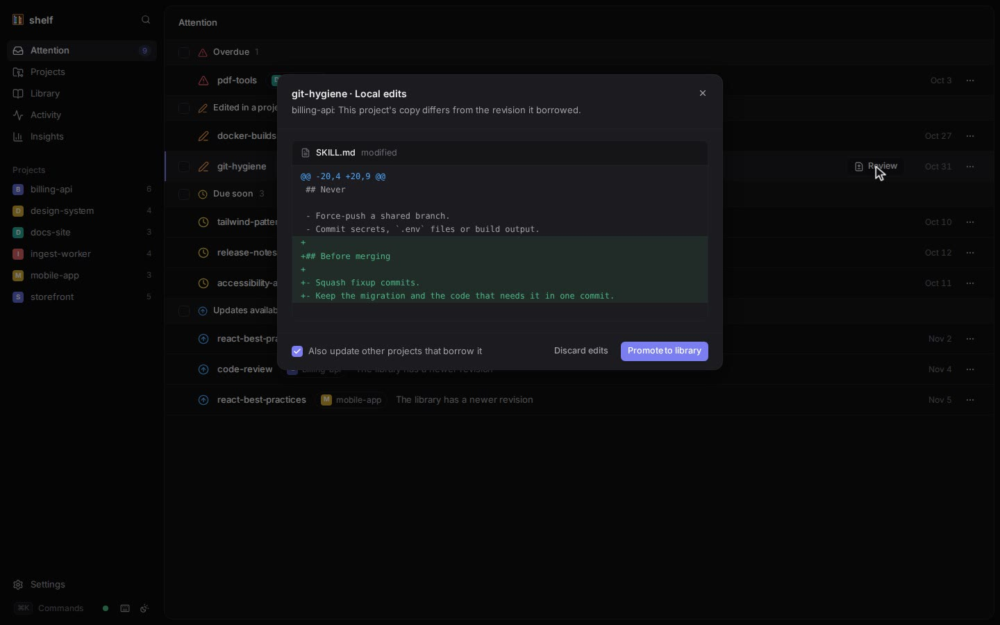

# Dashboard

The local dashboard that `shelf ui` opens shows everything shelf manages: loans that need you, projects, the library editor, revisions, activity, insights and settings. This page covers every page, the keyboard shortcuts, live updates, the token and security model, and phones.


## Start it

```console
$ shelf ui
shelf dashboard: http://127.0.0.1:4222/?token=<token>
Ctrl-C to stop.
```

shelf opens the URL in your browser (`open` on macOS, `cmd.exe /c start` in WSL, `xdg-open` elsewhere) and serves until you press Ctrl-C.

| Option | Effect |
|---|---|
| `--port N` | Listen on this port. Without it, the OS picks a free port each time. |
| `--no-open` | Print the URL without opening a browser. |
| `--rotate-token` | Replace the access token, signing out every browser. |
| `--json` | Print the URL as a JSON envelope. |

Pass a fixed `--port` if you want a bookmark that keeps working: the token survives restarts, but a random port doesn't. Everything is built into the binary (no Node, no CDN) and works offline.

The dashboard calls the same core functions as the CLI, so it behaves exactly like the commands. Changes you make there are recorded as `user:dashboard` in the activity log. Viewing never changes anything: unlike `shelf status`, opening a project page doesn't return overdue loans.

## Attention



The home page (`/`) lists every loan, across all your projects, that needs a decision, grouped by its most urgent reason:

| Section | Loans |
|---|---|
| Overdue | Past their due date, not yet returned: either the copy has local edits, which expiry never discards, or shelf hasn't synced the project since (the next session start, `shelf status` or `shelf sync` there returns it). The row says which. |
| Diverged | Edited in the project and in the library. |
| Edited in a project | The project copy has local edits. |
| Missing copies | Copies were deleted. |
| Due soon | Due within `dueSoonDays`, unused for a while. |
| Updates available | The library has a newer revision. |

Each row shows the skill, the project, why it is listed, and the due date. Hover a row (or look on a touch screen) for its quick action: **Renew**, **Review** or **Sync**. The **…** menu has every action for the loan (see [Project](#project)).

**Review** opens the changes dialog with a per-file diff:

- Local edits: **Promote to library** (with **Also update other projects that borrow it**, on by default) or **Discard edits**.
- Edited here and in the library: **Keep this project's** (promote with force) or **Take the library's**.
- Library update: **Update to latest**.

A banner warns when Claude Code or Codex has no shelf hooks, with a **Fix in settings** button. When nothing needs you, the page says **All caught up**.

## Projects

`/projects` lists every registered project with its overdue and due-soon counts, number of skills and when shelf last saw it. A project whose directory is gone is marked **missing**. Projects are registered with `shelf init` (or by running any shelf command in a clone); the dashboard can't add them.

## Project


A project page shows its **Borrowed skills**: state (Up to date, Behind, Edited, Diverged, Missing), due date or **Kept**, and last use. Click an Edited, Diverged or Behind pill to review the changes.

Each loan's **…** menu:

| Item | Does |
|---|---|
| Review edits… / Review library changes… | Opens the changes dialog. |
| Renew for N days | `shelf renew` with the skill's loan length. |
| Extend by a week | `shelf due <name> +7d`. |
| Keep — never expires / Stop keeping | `shelf keep` / `shelf keep --off`. |
| Update to latest | `shelf update`. |
| Return / Return and delete edits | `shelf return` / `shelf return --force`. Return runs at once; Return and delete edits asks for confirmation first, like bulk return (tick **Also delete local edits**). |

**Borrow skills** (or `b`) opens the borrow dialog: filter the library, toggle whole sets with their chips, see suggested skills first with their session cost, tick **Keep (never expires)** if wanted, and borrow. The dialog has no options for loan days, `--follow` or `--link`; use the CLI for those.

**Suggested for this project** lists library skills that match the project's dependencies and files, with the reason and session cost, and a **Borrow** button. See [Context budget](context-budget.md#shelf-suggest).

### Bulk actions

On Attention and project pages, tick several loans (or press `x`, shift-click for a range) and use the bar: **Renew**, **Update**, **Keep** / **Stop keeping**, **Return**. An action that applies to only some of the selection says how many. Bulk return asks for confirmation and leaves edited loans alone unless you tick **Also delete local edits**. One summary toast reports the result; failed rows stay selected.

## Library


`/library` lists your skills with their borrower count and session cost. The filter (`/`) searches inside skills too, SKILL.md and reference files, and shows the matching lines; click one to open that file. The page also has the **Sets** section (create, edit, delete; deleting offers **Undo**), **New skill**, and **Find existing skills**.

### Skill page

- **Editor.** SKILL.md and reference files open in an editor. Save with ⌘S (Ctrl+S); each save is a new revision. Leaving with unsaved changes asks first.
- **Lint strip.** Above SKILL.md, updated as you type: description and body tokens, format errors and warnings (the same rules as `shelf lint`).
- **Details.** Revision, number of revisions, tokens, **Loan length** (Default, 7, 14, 30, 60 or 90 days, capped at `maxLoanDays`), source and location.
- **Borrowed by.** Each borrowing project and its state. Tick the ones that are behind and **Update N to latest** (like `shelf propagate --project`). The **+** button borrows the skill into another project.
- **History.** Every revision; each opens its revision page.
- **Check for updates.** For skills linked to a source: fetches, audits and shows the diff, then **Apply to library** (high-severity findings need an extra checkbox).
- **…** menu: **Rename…**, **Duplicate…**, **Archive…**. Rename and archive are refused while the skill is borrowed, and list the borrowers.

### Revision page

Each revision shows what it changed, its files (read-only) and its metadata. **Compare with** picks another revision or the latest. **Restore this revision** makes it the library's latest again (borrowers keep theirs until updated).

## Find existing skills

`/find-skills`, reached from the Library header or ⌘K, scans a folder for skill copies and adopts them, like `shelf scan` and `shelf adopt`.

- The folder defaults to the one that holds your registered projects (for `~/code/a` and `~/code/b`, `~/code`), or your home directory. Depth is 1 to 10 levels, default 6.
- Results group copies by skill and version, marked **in library**, **library latest**, **old library revision** and **managed**.
- Tick unmanaged copies (or a whole group) and **Adopt N copies**. Within each skill, the library's or most common version is adopted first.
- **These copies have no local edits (older versions)** is `shelf adopt --unedited`.
- The result lists each copy as Imported, Matched, Older or Differs, with its loan and any audit findings.

See [Migrating](migrating.md).

## Activity


`/activity` is a timeline of the latest 300 events: who did what, in which project ("codex used api-design in billing-api · 2m ago"). Actors read `you`, `you (dashboard)`, `claude-code`, `codex` and so on. Similar events by the same actor in the same project within a minute are merged into one line.

## Insights


`/insights` shows what skills cost and how much they are used:

- Totals: skills in the library, active loans, median session context per project, skills unused in 30 days.
- **Context at session start**: a bar per project, split into skills loaded everywhere and borrowed skills; expand one for its skills.
- **Skills active per day**: a 30-day chart; pick a day to see which skills were used.
- **Skills**: every library skill with a 30-day sparkline, active days, last use, session and body tokens, and borrower count, sortable, with **never used** and **unused 30d** badges.
- **Loaded everywhere**: the user-level skills in `~/.claude/skills`, `~/.agents/skills` and the other harness folders.

See [Context budget](context-budget.md).

## Settings

`/settings` shows:

- the shelf version, home and library paths;
- **Agent hooks**: each harness's status (Installed, Not installed, Outdated, Settings unreadable, Not installed on this machine), with a reminder to trust Codex hooks in `/hooks`;
- **Health**: the `shelf doctor` checks, with a **Repair** button (`shelf doctor --fix`) when something is wrong;
- **Configuration**: every config key and its value, read-only. Edit `~/.shelf/config.json` to change them.

## Keyboard shortcuts

Press `?` to see them in the app.

| Key | Action |
|---|---|
| ⌘K / Ctrl+K | Search and commands |
| `g` then `a` / `p` / `l` / `y` / `i` / `s` | Go to Attention / Projects / Library / Activity / Insights / Settings (within 1 second) |
| `?` | Show shortcuts |
| `j` / `k`, ↓ / ↑ | Next / previous row |
| Enter | Open |
| `r` | Renew (Attention, project page) |
| `u` | Update to latest |
| `c` | Review changes |
| `x` | Select row |
| Esc | Clear selection, then the highlighted row |
| `b` | Borrow skills (project page) |
| `/` | Filter (library) |
| ⌘S / Ctrl+S | Save (editor) |

Single-key shortcuts stand down while you type in a field, while a dialog or menu is open, and when ⌘, Ctrl or Alt is held.

**⌘K** searches pages, projects ("Borrow skills into …" too), skills by name and description, and, from three characters, the content of skills (opening the file that matches). It also switches between light and dark themes.

## Live updates

The dashboard updates by itself as agents and the CLI work. The server checks the database every second and watches the library folder, and pushes a change event to open pages, which refetch. The dot in the sidebar footer shows **Live**, **Connecting…** or **Reconnecting…**. The connection pauses while the tab is hidden and reconnects (with backoff, up to 30 seconds) when it returns, refetching everything in case it missed a change.

## Themes

Dark, light, or following the system: choose in the sidebar footer's **Theme** menu (⌘K offers light and dark). The choice is kept in the browser.

## Security

- The server binds 127.0.0.1 only. shelf has no remote-access mode.
- Every API request needs the token, sent in a custom header. Other web pages can't send it (that would need CORS, which is never granted), which blocks cross-site requests.
- Every API request must name the loopback address in its `Host` header (`127.0.0.1:<port>` or `localhost:<port>`), which blocks DNS rebinding.
- The token lives in `~/.shelf/ui-token` (mode 0600), so bookmarks survive restarts. The app moves it from the URL into the browser's local storage and removes it from the address bar.
- If the token is missing or wrong, the app shows a **Connect to shelf** screen: open the link printed by `shelf ui`, or paste the token from it.
- `shelf ui --rotate-token` replaces the token and signs out every browser.
- A second `shelf ui` on a port that is already in use fails with `CONFLICT` instead of sharing it.

## Phones and tablets

The layout adapts to small screens: the sidebar becomes a drawer, detail panels stack under the content, dialogs become bottom sheets, and touch targets grow. Row actions and checkboxes are always visible on touch screens, since they can't hover.

Because the server only listens on 127.0.0.1 and checks the `Host` header, a phone can't reach it directly. If you want it on another device, forward the same port to that device's loopback yourself (for example an SSH tunnel, `ssh -L 4222:127.0.0.1:4222 <machine>`) and open the printed URL there. shelf doesn't provide or configure remote access.

## Related

- [`shelf ui`](cli/ui.md)
- [Files](files.md) (the token file)
